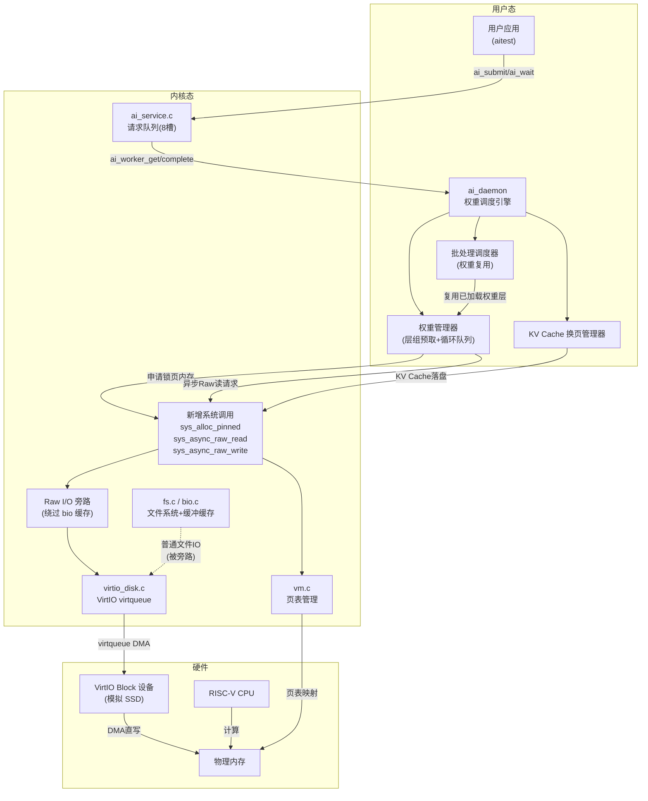
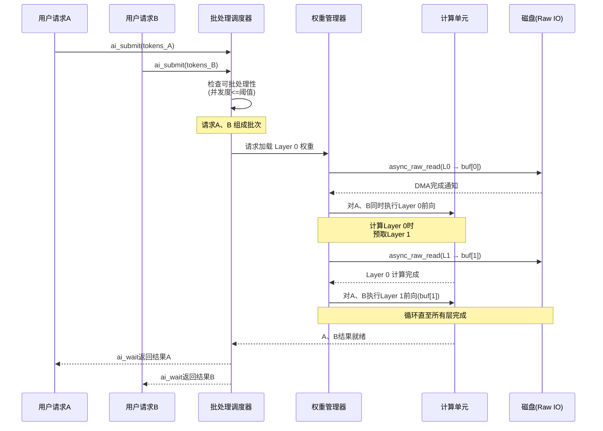
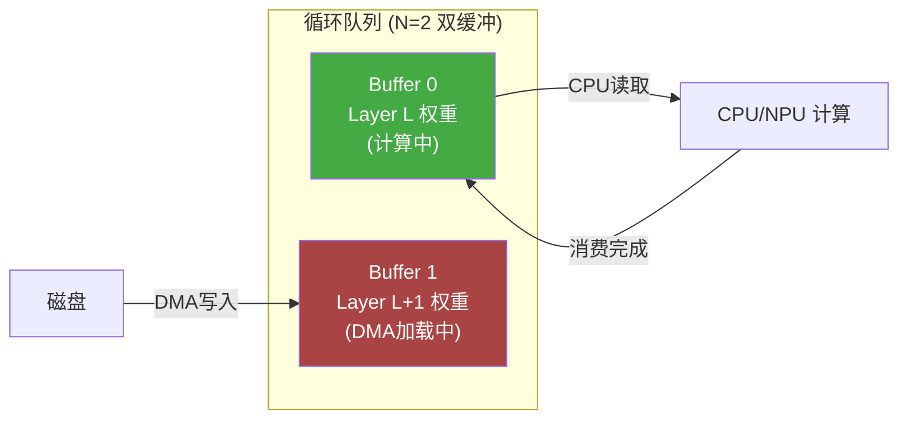
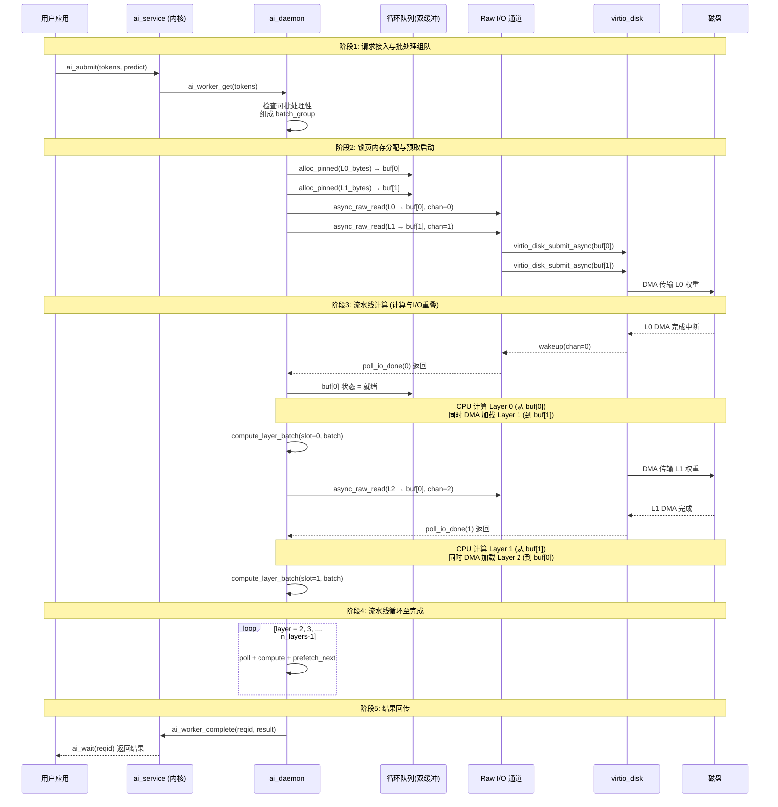
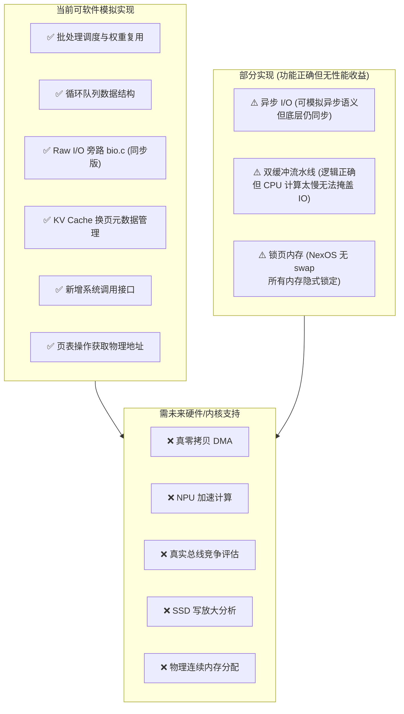

# 端侧大模型权重高效利用的系统设计与 NexOS 实现方案

## 一、问题定义与背景

在端侧部署大语言模型（如 SmolLM2-135M）时，模型权重通常按层载入内存并用于计算，其余权重存放于交换空间（磁盘）。当前 NexOS 的 `ai_daemon` 在启动时通过 `load_file()` 将**所有**权重文件（`EMB.BIN`、`NRM.BIN`、`L00.BIN`～`L29.BIN`、`ROP.BIN` 等）一次性读入用户态内存。这种方式在模型较小时可行，但当模型参数量增大、内存预算受限时，将面临"内存容量墙"与"I/O 瓶颈"。

本报告的目标是：在 NexOS 现有架构上，设计一套**权重复用 + DMA 双缓冲流水线 + Raw I/O 绕过文件系统缓存**的协同优化方案，使每次权重加载能服务更多计算工作，平衡 CPU 与 I/O 利用率，最大化推理吞吐率。

---

## 二、NexOS 现有架构分析

通过对 `kernel/` 和 `user/` 目录的代码分析，当前 NexOS 的关键模块如下：

### 2.1 AI 服务子系统（`kernel/core/ai_service.c` + `user/ai_daemon.c`）

NexOS 已实现完整的 AI 请求调度框架，采用**生产者-消费者模型**：

- **内核侧**（`ai_service.c`）：维护 8 个请求槽（`AI_NREQ=8`）的循环队列，请求状态机为 `UNUSED → READY → RUNNING → DONE/FAILED`。用户进程通过 `ai_submit` 提交请求，`ai_daemon` 通过 `ai_worker_get` 取出请求，处理完毕后通过 `ai_worker_complete` 回写结果。
- **用户侧**（`ai_daemon.c`）：`ai_daemon` 在 `main()` 中先调用 `daemon_runtime_init()` 加载全部模型权重到内存，然后进入无限循环 `ai_worker_get → handle_request → ai_worker_complete`。`handle_request` 调用 `run_decode`，其中已实现了**前缀缓存（Prefix Cache）**机制——当连续请求共享相同前缀时，可跳过 Prefill 阶段直接复用 KV Cache 快照。

### 2.2 文件系统与块设备（`kernel/fs/fs.c` + `kernel/core/bio.c` + `kernel/drivers/virtio_disk.c`）

- **缓冲区缓存**（`bio.c`）：维护 30 个 `struct buf`（每个 `BSIZE=16384` 字节 = 16KB），采用 LRU 策略。`bread()` 先查缓存，未命中则调用 `virtio_disk_rw()` 从磁盘读取。这是需要绕过的"文件系统页缓存"。
- **VirtIO 块驱动**（`virtio_disk.c`）：使用 VirtIO virtqueue 提交 I/O 请求。虽然 virtqueue 本身是异步通知机制，但当前 `virtio_disk_rw()` 是**同步阻塞**的——提交请求后通过 `sleep(b)` 等待完成中断。
- **文件读取路径**：`fileread → readi_user → bread → virtio_disk_rw`，数据从磁盘 → 块缓存 → 用户空间，存在二次拷贝。

### 2.3 虚拟内存管理（`kernel/core/vm.c`）

采用 RISC-V Sv39 三级页表。`walk()` 可遍历页表获取 PTE，`mappages()` 可建立虚拟地址到物理地址的映射，`copyin/copyout` 在内核与用户空间间拷贝数据。当前**不支持**锁页内存（pinned memory）和物理连续内存分配的显式接口。

### 2.4 系统调用接口（`kernel/include/syscall.h`）

已有 28 个系统调用，包括文件操作（`open/read/write/close`）和 AI 服务（`ai_call/ai_submit/ai_wait/ai_query/ai_worker_*`）。尚未提供异步 I/O 或直接 I/O 相关的系统调用。

---

## 三、端侧权重优化系统整体设计

### 3.1 整体架构

以下 Mermaid 图展示了加入权重优化后的系统整体架构：



### 3.2 三大优化模块设计

#### 3.2.1 权重复用与多请求批处理

**核心思想**：`ai_daemon` 当前逐个串行处理请求。优化后，调度器在取出请求时检查是否有多个请求可以共享同一次权重前向传播。当多个请求的 Prompt 需要经过相同的网络层时，只加载一次层权重，同时对多个请求执行计算。

**并发度自适应**：当并发度过高导致 I/O 利用率下降（I/O 在等 CPU）时，调度器自动降低批处理大小。

**KV Cache 换页**：多请求下 KV Cache 无法全部放入内存时，将冷请求的 KV Cache 通过 Raw I/O 写入磁盘专用分区。



#### 3.2.2 DMA 双缓冲循环队列

**核心思想**：维护 $N$ 个缓冲区（循环队列），每个缓冲区存储一层的权重。CPU 计算第 $L$ 层时，I/O 同时将第 $L+1$ 层权重 DMA 写入下一个缓冲区。理想条件下，I/O 时间被计算时间完全掩盖。

**生产者-消费者模型**：I/O 线程为生产者（向缓冲区填充权重），计算线程为消费者（从缓冲区读取权重计算）。使用信号量同步。

当前 `virtio_disk.c` 的 virtqueue 已经具备 DMA 描述符链的能力，但 `virtio_disk_rw()` 是同步的。优化后新增异步接口，提交请求后立即返回，完成后通过中断回调通知。



#### 3.2.3 Raw I/O 绕过文件系统缓存

**核心思想**：标准文件读取路径 `fileread → readi_user → bread → virtio_disk_rw` 中，`bread()` 会将数据缓存到 `bio.c` 的 30 个 `buf` 中。对于大模型权重这种一次性大批量顺序读取的场景，块缓存不仅无用（LRU 会立即淘汰），还浪费内存并引入额外拷贝。

Raw I/O 旁路方案：新增系统调用 `sys_async_raw_read`，直接将磁盘扇区数据通过 VirtIO virtqueue DMA 传输到用户态预分配的锁页内存中，完全绕过 `bio.c` 缓存层。

---

## 四、关键数据结构与伪代码

### 4.1 新增数据结构

```c
// ===== 内核侧 (kernel/core/ai_service.c 或新文件) =====

// 层组元数据：描述一次预取操作需要加载的权重范围
struct layer_group_spec {
    int layer_start;          // 起始层号
    int layer_end;            // 结束层号(不含)
    uint64 disk_lba_offset;   // 权重在磁盘上的起始LBA扇区
    uint64 total_bytes;       // 本次传输总字节数
    int buf_slot;             // 目标缓冲区槽位
};

// Raw I/O 请求块：在内核与驱动间传递
struct raw_io_block {
    uint64 target_paddr;      // 目标锁页内存物理地址
    uint64 disk_lba;          // 磁盘LBA扇区号
    uint64 transfer_size;     // 传输字节数(必须为块大小整数倍)
    int completion_chan;      // 完成通知通道(sleep/wakeup的chan)
    int status;               // 0=进行中, 1=完成, -1=失败
};

// 锁页内存句柄
struct pinned_mem_handle {
    uint64 vaddr;             // 用户态虚拟地址
    uint64 paddr;             // 物理地址(告知DMA用)
    uint64 size;              // 大小
    int ref_count;            // 引用计数
};

// ===== 用户侧 (user/ai_daemon.c 扩展) =====

// 循环队列缓冲区：承载DMA写入的锁页内存
struct ring_buffer_io {
    int head;                 // 消费者读取位置
    int tail;                 // 生产者写入位置
    int n_slots;              // 缓冲区数量(推荐2=双缓冲)
    struct pinned_mem_handle *slots;  // 各槽位的锁页内存
    int *slot_status;         // 各槽位状态: 0=空闲 1=加载中 2=就绪 3=消费中
    int layer_idx_per_slot[8];// 记录每个槽位当前存储的层号
};

// 批处理请求组
struct batch_group {
    int req_ids[8];           // 批内请求ID列表
    int n_reqs;               // 批内请求数
    int current_layer;        // 当前计算到的层号
    int total_layers;         // 总层数(如SmolLM2=30)
    struct ring_buffer_io *rbuf; // 关联的循环队列
};

// KV Cache 换页元数据
struct kv_swap_meta {
    int req_id;               // 所属请求
    int layer_idx;            // 层号
    uint64 disk_lba;          // 落盘后的磁盘LBA
    int in_ram;               // 1=在内存中, 0=已换出
    float access_score;       // 访问热度(用于淘汰决策)
};
```

### 4.2 新增系统调用

```c
// kernel/include/syscall.h 新增
#define SYS_alloc_pinned     29  // 分配锁页内存
#define SYS_free_pinned      30  // 释放锁页内存
#define SYS_async_raw_read   31  // 异步Raw读
#define SYS_async_raw_write  32  // 异步Raw写(用于KV Cache落盘)
#define SYS_poll_io_done     33  // 轮询/等待异步IO完成
```

```c
// user/user.h 新增用户态接口
int alloc_pinned(uint64 size, uint64 alignment, struct pinned_mem_handle *out);
int free_pinned(struct pinned_mem_handle *handle);
int async_raw_read(uint64 paddr, uint64 disk_lba, uint64 size, int chan_id);
int async_raw_write(uint64 paddr, uint64 disk_lba, uint64 size, int chan_id);
int poll_io_done(int chan_id);  // 阻塞等待指定IO完成
```

### 4.3 核心伪代码

#### 4.3.1 内核：异步 Raw I/O 实现

```c
// kernel/core/raw_io.c (新增文件)

// 异步 Raw 读：绕过 bio.c 缓存，直接提交 virtio 请求
int sys_async_raw_read(uint64 paddr, uint64 disk_lba, uint64 size, int chan_id) {
    struct proc *p = myproc();
    // 校验：paddr 必须页对齐、size 必须为 BSIZE 整数倍
    if (paddr % PGSIZE != 0 || size % BSIZE != 0) return -1;

    // 构造一个临时 buf 结构，但不走 bcache
    struct buf tmp;
    tmp.blockno = disk_lba / (BSIZE / 512);
    tmp.data = (uchar *)paddr;  // 直接指向锁页内存物理地址

    // 提交到 virtio virtqueue，但不阻塞等待
    // 需要 virtio_disk.c 新增异步提交接口 virtio_disk_rw_async()
    int desc_idx = virtio_disk_submit_async(&tmp, 0 /*read*/);

    // 注册完成回调：中断到来时 wakeup(chan_id)
    register_io_completion(desc_idx, chan_id);
    return 0;  // 立即返回，不阻塞
}

// virtio_disk.c 异步接口扩展
int virtio_disk_submit_async(struct buf *b, int write) {
    acquire(&disk.vdisk_lock);
    int idx[3];
    // 分配描述符(可能需要等待)
    while (alloc3_desc(idx) < 0) {
        sleep(&disk.free[0], &disk.vdisk_lock);
    }
    // 组装 virtio_blk_req 并提交到 avail ring
    // ... (与现有 virtio_disk_rw 相同的描述符链构建逻辑)
    disk.info[idx[0]].b = b;
    b->disk = 1;
    // 通知设备
    *R(VIRTIO_MMIO_QUEUE_NOTIFY) = 0;
    release(&disk.vdisk_lock);
    return idx[0];  // 返回描述符索引用于完成追踪
}
```

#### 4.3.2 内核：锁页内存分配

```c
// kernel/core/vm.c 扩展

// 分配物理连续、页对齐、不可换出的内存
int sys_alloc_pinned(uint64 size, uint64 alignment, uint64 handle_uva) {
    struct proc *p = myproc();
    uint64 npages = size / PGSIZE;
    if (size % PGSIZE != 0) npages++;

    // 在用户地址空间分配连续虚拟页
    uint64 vaddr = p->sz;
    p->sz += npages * PGSIZE;

    // 分配物理页并映射(标记 PTE_D=不可换出，NexOS当前无swap但预留)
    for (uint64 i = 0; i < npages; i++) {
        void *mem = kalloc();
        if (mem == 0) { /* 回滚已分配页 */ return -1; }
        memset(mem, 0, PGSIZE);
        if (mappages(p->pagetable, vaddr + i*PGSIZE, PGSIZE,
                     (uint64)mem, PTE_R | PTE_W | PTE_U) != 0) {
            kfree(mem);
            return -1;
        }
    }

    // 构造 handle 返回给用户态
    struct pinned_mem_handle handle;
    handle.vaddr = vaddr;
    handle.paddr = walkaddr(p->pagetable, vaddr);  // 获取物理地址
    handle.size = npages * PGSIZE;
    handle.ref_count = 1;

    // copyout 到用户空间
    if (copyout(p->pagetable, handle_uva, (char *)&handle, sizeof(handle)) < 0)
        return -1;
    return 0;
}
```

#### 4.3.3 用户态：ai_daemon 权重管理器与批处理调度

```c
// user/ai_daemon.c 扩展

// 初始化循环队列
static int weight_ringbuffer_init(struct daemon_runtime *dr, int n_slots) {
    struct ring_buffer_io *rb = &dr->weight_rbuf;
    rb->n_slots = n_slots;
    rb->head = 0;
    rb->tail = 0;
    uint64 layer_bytes = compute_layer_bytes(&dr->rt.cfg);  // 单层权重大小

    for (int i = 0; i < n_slots; i++) {
        // 分配锁页内存
        if (alloc_pinned(layer_bytes, PGSIZE, &rb->slots[i]) < 0)
            return -1;
        rb->slot_status[i] = 0;  // 空闲
        rb->layer_idx_per_slot[i] = -1;
    }
    return 0;
}

// 生产者：异步加载指定层权重到指定缓冲区槽位
static int prefetch_layer_async(struct daemon_runtime *dr, int layer_idx, int slot) {
    struct ring_buffer_io *rb = &dr->weight_rbuf;
    uint64 lba = compute_layer_lba(&dr->rt.cfg, layer_idx);
    uint64 bytes = compute_layer_bytes(&dr->rt.cfg);
    uint64 paddr = rb->slots[slot].paddr;

    rb->slot_status[slot] = 1;  // 加载中
    rb->layer_idx_per_slot[slot] = layer_idx;

    // 提交异步 Raw I/O 请求
    int chan_id = layer_idx;  // 用层号作为通知通道
    if (async_raw_read(paddr, lba, bytes, chan_id) < 0)
        return -1;
    return 0;
}

// 消费者：等待指定槽位就绪并执行计算
static int compute_layer_batch(struct daemon_runtime *dr, int slot,
                               struct batch_group *bg) {
    struct ring_buffer_io *rb = &dr->weight_rbuf;
    int layer = rb->layer_idx_per_slot[slot];

    // 等待 I/O 完成
    poll_io_done(layer);
    rb->slot_status[slot] = 3;  // 消费中

    // 从锁页内存加载权重到运行时结构
    float *weight_ptr = (float *)rb->slots[slot].vaddr;
    parse_layer_from_memory(&dr->rt.layers[layer], (char *)weight_ptr,
                            compute_layer_bytes(&dr->rt.cfg),
                            &dr->rt.cfg, dr->rt.layer_kinds[layer]);

    // 对批处理组中的所有请求执行该层前向计算
    for (int i = 0; i < bg->n_reqs; i++) {
        // 复用已加载的 dr->rt.layers[layer] 权重
        llm_apply_full_layer(&dr->rt, dr->kcache, dr->vcache, layer,
                             bg->req_positions[i], &dr->ws);
        llm_apply_ffn(&dr->rt.cfg, &dr->rt.layers[layer], &dr->ws);
    }

    rb->slot_status[slot] = 0;  // 释放
    return 0;
}

// 批处理调度主循环
static int run_batched_inference(struct daemon_runtime *dr,
                                 struct batch_group *bg) {
    int n_layers = dr->rt.cfg.n_layers;
    struct ring_buffer_io *rb = &dr->weight_rbuf;
    int n_slots = rb->n_slots;

    // 预取前 n_slots 层
    for (int i = 0; i < n_slots && i < n_layers; i++) {
        prefetch_layer_async(dr, i, i);
    }

    // 流水线执行
    for (int layer = 0; layer < n_layers; layer++) {
        int slot = layer % n_slots;

        // 消费当前层(等待该槽位就绪)
        compute_layer_batch(dr, slot, bg);

        // 生产下一轮：预取 layer + n_slots 层
        int next_layer = layer + n_slots;
        if (next_layer < n_layers) {
            prefetch_layer_async(dr, next_layer, slot);
        }
    }
    return 0;
}
```

#### 4.3.4 KV Cache 换页（内存不足时）

```c
// user/ai_daemon.c - KV Cache 换页

// 当多请求 KV Cache 超过内存阈值时，将冷请求 KV Cache 落盘
static int kv_cache_swap_out(struct daemon_runtime *dr, int req_id) {
    struct kv_swap_meta *meta = find_kv_meta(req_id);
    uint64 kv_bytes = dr->kv_cache_elems * sizeof(float);

    // 分配锁页内存暂存待写出的 KV Cache
    struct pinned_mem_handle tmp;
    alloc_pinned(kv_bytes, PGSIZE, &tmp);

    // 拷贝 KV Cache 到锁页内存
    memmove((void *)tmp.vaddr, dr->kcache, kv_bytes);

    // 异步 Raw 写入磁盘专用分区
    uint64 swap_lba = alloc_swap_lba(kv_bytes);
    async_raw_write(tmp.paddr, swap_lba, kv_bytes, req_id);
    poll_io_done(req_id);

    // 更新元数据
    meta->disk_lba = swap_lba;
    meta->in_ram = 0;

    // 释放锁页内存，清空 DRAM 中的 KV Cache
    free_pinned(&tmp);
    memset(dr->kcache, 0, kv_bytes);
    return 0;
}
```

---

## 五、一次推理请求的完整协同工作流程

以下时序图展示了优化后的一次完整推理请求流程（含双缓冲流水线与批处理）：



---

## 六、参考的论文与系统

| 编号 | 论文/系统 | 核心借鉴点 |
|:---|:---|:---|
| 1 | **LLM in a flash** (Alizadeh et al., arXiv:2312.11514) | 上下文稀疏性预测、滑动窗口内存管理、行列捆绑布局优化 DMA 传输效率 |
| 2 | **ActiveFlow / Active-Weight Swapping** (arXiv:2504.08378) | 活跃权重 DRAM-Flash 交换流水线、层组 (Layer Group) 预取机制、锁页内存作为 DMA 目标 |
| 3 | **KVSwap** (arXiv:2511.11907) | KV Cache 磁盘换页框架、基于注意力分数的精准预取与分组淘汰策略 |
| 4 | **HiFC** (NeurIPS 2025) | 高效 Flash-based KV Cache 交换，写放大效应分析与 SSD 寿命考量 |
| 5 | **Linux O_DIRECT** (POSIX Direct I/O) | 绕过页缓存的直接 I/O 机制，用户态缓冲区对齐与大小约束 |
| 6 | **VirtIO Specification** | virtqueue 描述符链、可用环/已用环的异步通知机制，作为 DMA 传输的底层基础 |
| 7 | **NexOS / xv6 教学内核** | 生产者-消费者请求队列、sleep/wakeup 同步原语、三级页表管理、块缓冲缓存 |
| 8 | **KVStream** (Microsoft, 2025) | 端侧 LLM 推理内存管理，KV Cache 流式淘汰策略 |

---

## 七、实现边界分析：当前可实现 vs. 需未来支持

### 7.1 可基于当前 NexOS 实现的部分

| 模块 | 可实现内容 | 依据 |
|:---|:---|:---|
| **请求调度与状态管理** | 批处理调度器、并发度自适应、请求状态机扩展 | `ai_service.c` 已有 8 槽请求队列和完整状态机，可直接扩展 `batch_group` 字段 |
| **权重复用** | 多请求共享同一次权重前向传播 | `ai_daemon.c` 的 `run_decode_steps()` 已按层循环，可改为对多请求批量执行 `llm_apply_full_layer` |
| **前缀缓存复用** | 多请求前缀匹配与 KV Cache 复用 | `ai_daemon.c` 已实现 `daemon_prefix_cache`，可扩展为多请求共享 |
| **Raw I/O 旁路 (软件模拟)** | 新增系统调用绕过 `bio.c`，直接调用 `virtio_disk_rw` | `virtio_disk.c` 已暴露 `virtio_disk_rw()`，可构造临时 `buf` 直接调用，跳过 `bread/brelse` |
| **双缓冲流水线 (软件模拟)** | 循环队列结构、生产者-消费者同步、层组预取逻辑 | 使用 `sbrk` 分配用户态内存模拟锁页内存，通过 `sleep/wakeup` 实现同步 |
| **KV Cache 换页 (逻辑)** | 元数据管理、淘汰决策、通过文件系统写入 | `ai_daemon.c` 的 `prefix_cache_save_after_prefill` 已有 KV Cache 序列化的雏形 |
| **系统调用扩展** | 新增 `sys_alloc_pinned`、`sys_async_raw_read` 等 | `syscall.c` 已有清晰的系统调用分发机制，新增条目即可 |
| **页表操作** | 获取物理地址、建立映射 | `vm.c` 的 `walk()`、`walkaddr()`、`mappages()` 可直接使用 |

### 7.2 需要 NexOS 未来进一步支持的部分

| 模块 | 限制 | 需要的支持 |
|:---|:---|:---|
| **真正的异步 I/O** | `virtio_disk_rw()` 当前同步阻塞，提交后 `sleep(b)` 等待完成 | 需将 `virtio_disk.c` 重构为异步提交 + 中断回调模式，`virtio_disk_isr()` 中 `wakeup` 指定 `chan` 而非通用 `b` |
| **真零拷贝 DMA** | 当前 virtio 描述符指向 `b->data`（内核缓存），非用户态物理地址 | 需修改 virtio 驱动，使描述符 `addr` 直接指向用户态锁页内存物理地址，绕过内核 `buf` 中间层 |
| **物理连续内存分配** | `kalloc()` 分配单页 (4KB)，无法保证多页连续 | 需实现连续物理页分配器（类似 `__get_free_pages`），或使用散列-收集 (scatter-gather) 描述符链 |
| **锁页内存 (Pinned Memory)** | NexOS 无 swap 机制，所有内存隐式"锁定"，但无显式标记 | 虽然功能上等价，但未来若引入 swap 需添加 `PTE_D` (dirty/non-pageable) 标志位 |
| **NPU/Tensor Core 加速** | 矩阵乘法在 CPU 上用 `qmatmul` 软件执行，$T_{compute} \gg T_{io}$ | 需 NPU 驱动支持，否则双缓冲流水线在 CPU 模拟下无法体现"计算掩盖 I/O"效果 |
| **磁盘分区管理** | 当前只有一个 virtio block 设备，无分区概念 | 需要支持磁盘分区或第二块专用块设备，用于权重 Raw I/O 与 KV Cache swap 分区 |
| **真实 DMA 总线竞争** | QEMU 模拟环境下 DMA 与 CPU 共享内存总线的行为与真实 SoC 不同 | 需真实端侧硬件 (如带 NPU 的 ARM SoC) 验证 UMA 总线竞争效应 |
| **SSD 写放大与寿命** | QEMU virtio-blk 无 FTL 层，无法模拟闪存擦写特性 | 需真实 NVMe/eMMC 设备评估 KV Cache 换页的写放大影响 |
| **并发度-CPU/IO 利用率测试** | 单核 QEMU 环境下无法真实测量 CPU-I/O 重叠 | 需多核支持或真实硬件，使用硬件性能计数器测量利用率 |

### 7.3 可行性评估总结



---

## 八、总结

本报告基于 NexOS 现有代码实现，设计了一套端侧大模型权重高效利用的协同优化方案，核心包含三大机制：

1. **权重复用与批处理调度**：扩展 `ai_service.c` 的请求队列，在 `ai_daemon.c` 中新增 `batch_group` 调度器，使多个请求共享同一次权重加载与前向计算。该设计可直接基于现有 8 槽请求队列和 `run_decode_steps` 层循环实现。

2. **DMA 双缓冲循环队列**：引入 `ring_buffer_io` 结构，CPU 计算第 $L$ 层时 I/O 同时预取第 $L+N$ 层。该设计的循环队列结构、生产者-消费者同步逻辑可在当前 NexOS 用户态完全实现；但真正的异步 DMA 需要将 `virtio_disk.c` 从同步阻塞重构为异步提交模式。

3. **Raw I/O 绕过文件系统缓存**：新增 `sys_async_raw_read` 系统调用，绕过 `bio.c` 的 30 个 `buf` 缓存，直接将磁盘数据 DMA 传输到用户态锁页内存。当前可通过构造临时 `buf` 直接调用 `virtio_disk_rw` 来模拟旁路逻辑。

当前 NexOS 可完全实现软件层面的调度逻辑、数据结构和接口定义，但受限于 QEMU 单核模拟环境和 CPU 软件矩阵乘法，真正的"计算与 I/O 重叠"性能收益需等待 NPU 驱动和多核支持等未来能力。该设计为 NexOS 演进为端侧智能操作系统提供了架构清晰、逻辑严密的实现蓝图。
