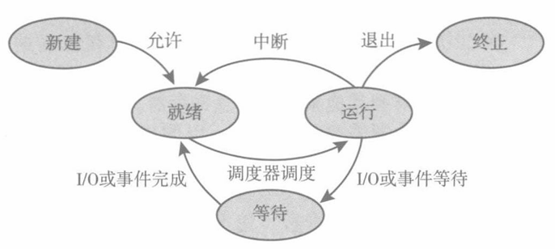

## 3-进程管理
进程与程序
- 程序：一段可执行文件
- C 程序的编译：预处理（展开条件编译、宏、头文件等）→编译（生成 `.s` 文件）→汇编（生成 `.o` 文件）→链接静态/动态库（生成可执行文件）
  - 静态链接：把 `.a` 文件直接与 `.o` 文件“拼接”；动态链接：在执行时根据需要随时访问 `.so` 文件中的信息
  - 可执行文件仍然是静态的
- 进程：一个执行实例（动态）
- 一个进程也可以是其它代码的运行环境

进程在内存中的组成
- 代码段：可执行文件的代码
- 数据段：全局变量
- 栈：临时数据（函数参数、返回地址、局部变量）
- 堆：进程运行时动态分配的内存

进程状态：新创建、运行中、等待、就绪、终止
- 新创建：进程正在被创建
- 运行中：进程正在执行指令
- 等待：进程等待一些外部信号才能继续运行（如等待 I/O 完成）
- 就绪：进程可以被分配给一个处理器
- 终止：进程已经执行完成
- 各种状态之间的转移示意图（**关注书上原图**）

（**重要**）进程控制块（PCB）：为了让内核更好地管理进程，建立的一种数据结构
- 有什么数据？
- 如何进行管理？队列/双向链表

进程相关操作
- 系统必须提供的机制：进程标识/创建/执行
- 进程标识：最基础的操作
  - 给每个进程提供一个整数编号（PID）
  - Linux 中通过调用 `getpid()` 函数获取
- 进程创建：多任务系统的需要
  - 父进程（创建新进程的进程）；子进程（新产生的进程）
  - 使用树形结构对所有进程进行管理
    - 问题：孤儿进程，一个进程的祖先进程先于其本身运行结束
    - Linux 的解决方案：re-parent 操作，把孤儿进程“过继”给原先该进程的最祖先进程
    - Windows 的解决方案：使用 forest-like 的进程结构
  - 父子进程之间的关系
    - 资源共享角度：共享所有资源 / 共享部分资源 / 不共享资源？
    - 执行角度：并发执行 / 父进程等待子进程终止？
    - 地址空间角度：子进程是父进程的副本（子进程复制父进程地址空间的内容）/ 子进程加载一个新的程序？
  - Linux 中通过 `fork()` 系统调用创建新进程
    - 注意含有 `fork()` 的代码在执行上的顺序关系！
    - 子进程开始执行的位置是 `fork()` 返回的地方，而不是 `main()` 的入口！
      - 这种机制可以避免子进程再次通过同一个 `fork()` 产生子进程的无限循环
    - `fork()` 产生的子进程复制了父进程的代码、进程内存、已打开的文件（如 `stdin/stdout/stderr`）、**程序计数器**
    - 父进程中 `fork()` 返回值为子进程的 PID，子进程中同一个 `fork()` 的返回值为 0
