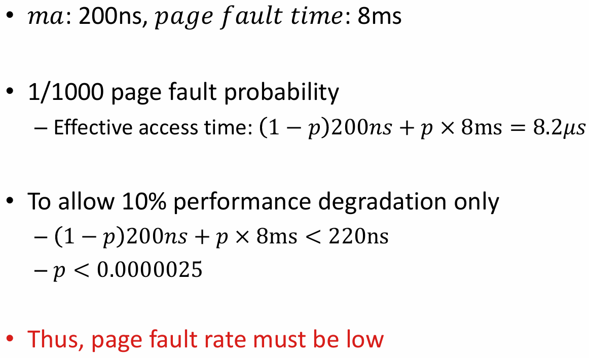
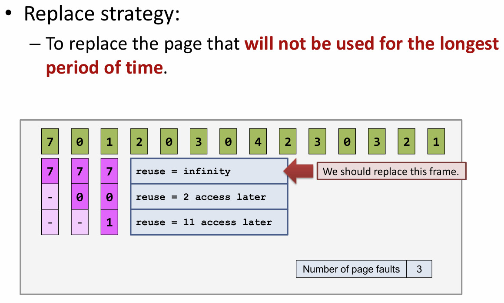

请求调页
- 在访问的时候按需分配内存
  - 在变量声明时只是预先分配地址空间，没有真正分配页（没有建立逻辑地址到物理地址的映射）
  - 在需要对变量进行修改时，才真正向操作系统请求分配内存
  - 类比：类似于*机票超售*的思想，只在乘客值机时才真正分配座位
- 在执行过程中可能遇到的问题
  - 在第一次访问的时候，可能出现 Page Fault，页未在内存中分配
    - 实际上后续访问也可能因为*实际分配的空间在外存中*而出现 Page Fault
    - 通过**中断**，使用专门的代码处理缺页异常（**PTE**）
  - “超售”导致没有空闲页用于分配
    - 选择某些当前进程不使用的页面放入外存，同时保存页面映射信息；从而空出内存空间
    - 换出操作 Swap Out，涉及**交换分区**
    - 置换算法，访问外存时的 I/O 性能比内存显著更低
    - 换入操作 Swap In，已经换出的页面需要再次访问
- 交换分区：位于物理外存中，通常大小至少与内存相同
- 系统理论上允许进程占用的最大内存空间：物理内存大小+交换分区可用大小 **-内核内存占用**
- COW(Copy On Write)：在 `fork()` 时，只有对子进程**需要修改的页面**才真正进行复制和修改
- 性能分析：Page Fault 中断的出现频率不能过高
  - 中断处理的时间远高于正常访问
  - Page Fault 的频率需要极低，才能不显著影响性能
    

页面置换算法
- 主要问题：选哪个页面换出？
- 最优算法：如果能预先知道页面的访问序列，就能据此作出最佳的置换决策
  - 将在未来最长时间不使用的页面换出
    
  - 在实际中，不可能预先知道 `reuse` 变量的值，需要采用**在线算法**
- FIFO：把在内存中**存在时间最久**的页面换出
  - 完全不考虑未来对于页面访问的特征
  - 性能表现远远差于最优算法：Page Fault 次数可能很大
  - 优化的想法：尝试了解未来页面访问的情况，**避免刚换出的页面短时间内又被换入**
- LRU(Lease Recently Used)：利用页面访问的局部性，用过去访问的历史预测未来
  - 实际访问的过程有比较强的**局部性**：最近经常访问的页面，在将来很有可能再次被访问
  - 核心思想：选择最近访问次数最少的页面换出
  - 初始时把所有页面的访问次数归为 0；对于每次访问，把当前访问的页面的 `age` 重置为 0，其余所有在内存中的页面的 `age` 都自增
  - 主要的问题：需要依赖于一个动态更新的计数器寻找 `age` 最大的页面
  - 在实际系统中，常通过一个硬件上提供的 **reference bit** 来近似 LRU 算法的效果
