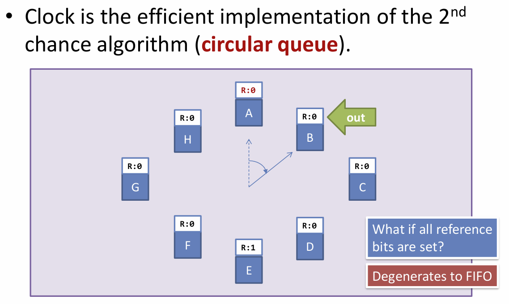
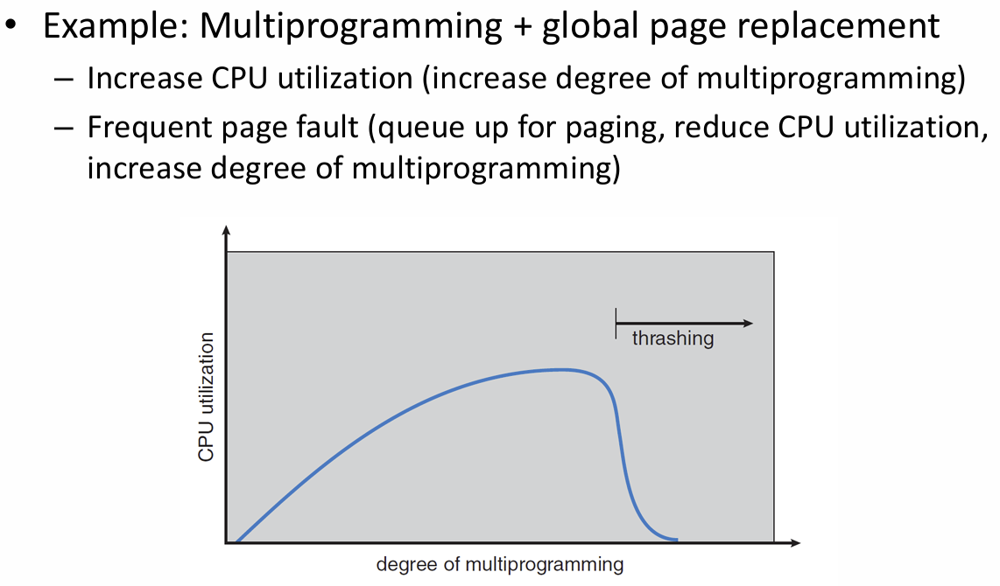
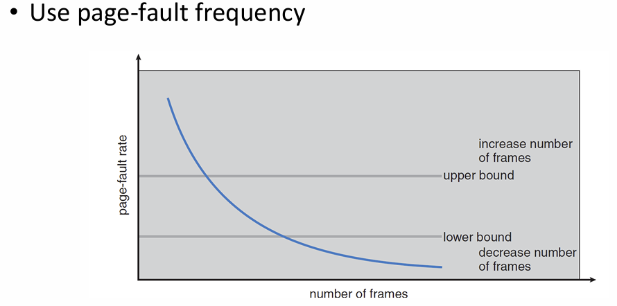

LRU 的近似实现思路：二次机会 second-chance algorithm
- 设置一个**访问位**，指示这个页面是否被访问过
- 顶层使用一个 FIFO 队列，每次需要换页时选取队首的页面进行判断
- 如果队首页面的访问位为 0，则直接将该页面换出；如果访问位为 1，则把该页面的访问位重置为 0 并**重新放入队尾**
- 进一步改进：访问位+修改位，修改位指示该页面是否被修改过
- 具体实现：时钟算法
  
  - 如果所有页面都曾经被访问过，实际上退化为 FIFO 算法

LFU/MFU 替换算法：换出访问总次数最少/多的页面
- 需要**维护一个计数器**统计每个页面的总访问次数
- [为什么有 MFU 算法？](https://gemini.google.com/share/8cdcdcf123f1)

物理页框的数量与性能的关系
- 预期：页框数量越多，性能越好
- 采用 FIFO 算法时，可能存在 [Belady 异常](https://gemini.google.com/share/bb90103d8173)
  - **要能构造一个例子进行解释**
- 堆栈算法：不存在 Belady 异常的页面置换算法
  - [具备的特性](https://gemini.google.com/share/3f4ffa5c87ec)

页框分配
- 维护一个**空闲页框列表**
- 需要考虑的问题
  - 上界：分配给一个进程的页框数量不能超过可用的页框总数
  - 下界：分配的页框数量不能过少
    - 需要限制 Page Fault 率，就不能分配太少的页框
    - 如果指令集中存在同时访问多个内存地址的指令，分配给每个进程的页框数就不能少于并行访问的内存地址数量
- 全局/局部置换
  - 全局置换：一个进程可以从所有进程的总页框集合中选择置换对象
    - 有利于充分利用系统整体的空余内存，但会导致一个进程的 page fault rate 受到其它进程行为的影响
  - 局部置换：一个进程只能在分配给自己的页框集合中选择置换对象
    - 保证进程性能之间的独立性，但要求系统能给每个进程分配一个恰当数量的页框，否则会导致进程 page fault rate 过高
- 跨进程的页框分配方案：假设有 $m$ 个页框、$n$ 个进程
  - 平均分配：每个进程都分配 $\frac{m}{n}$ 个页框
  - 按比例分配：假设第 $i$ 个进程的虚拟内存大小是 $s_i$，则给第 $i$ 个进程分配页框数 $a_i=\frac{s_i}{\sum s_i}\times m$
  - 基于优先级：分配给某个进程的页框数量不仅取决于进程大小，还取决于**进程的优先级**
    - 例如，音频处理等实时任务的进程规模较小，但是仍然需要分配足够数量的页框以保证低延迟
- 抖动：
  - 一个进程分配的页框数太少，造成频繁的页面换入换出和 Page Fault，导致**分页系统占用的运行时长比实际程序执行的时长更长**
  - **（重要）**典型例子：多道程序
    
    - 现象：随着任务数增加，CPU 利用率先增加，到达一定限度之后急剧下降
    - 实际上是一个**多维资源调度问题**
      - 只关注 CPU 资源的利用情况，但忽略了内存资源等其它资源的利用情况
  - 通过**工作集**策略来估计每个进程需要多少页框
    - 工作集：在最近 $\Delta$ 个页面访问中涉及的页面集合
    - 如果给定的页框数量大于工作集大小，就不会出现抖动问题
    - 假设第 $i$ 个进程的工作集大小为 $\text{WSS}_i$，则当 $\sum\text{WSS}_i>m$ 时，可能出现抖动问题
  - 自适应调节方案：通过 **page fault rate 指标**辅助判定页框分配情况
    
    - 通常同时使用 page fault rate 的上下界，避免在界限附近出现页框分配数频繁增减

内核的内存分配
- 分配特性（[详细解释](https://gemini.google.com/share/99e57a8b4561)）
  - 连续性要求：一些硬件设备需要在内存中映射到一个连续空间
    - 解决方案：采用伙伴系统 Buddy System 保证分配连续的页框
  - 小尺寸：内核中存在大量种类繁多的数据结构，它们的大小通常远小于一个物理页框；如果直接按页分配会造成严重的内部碎片问题
    - 解决方案：Slab 分配

内存映射文件
- 核心概念：通过 `mmap()` 系统调用，在进程虚拟内存地址和文件之间建立对应关系
  - 文件被视为内存中的字节数组，可以通过访问内存的方法来访问文件
- 文件访问过程
  - 初次访问：请求调页，触发 Page Fault 将文件相应部分的内容从磁盘加载到物理内存
  - 后续访问：与常规内存访问方式完全相同
- 优势：减少对文件读写过程的系统调用次数，从每次读写都需要调用 `read()/write()` 优化为**只在发生 Page Fault 时由操作系统介入**
- 可以在不重复拷贝的情况下，让多个进程同时映射到一个文件
