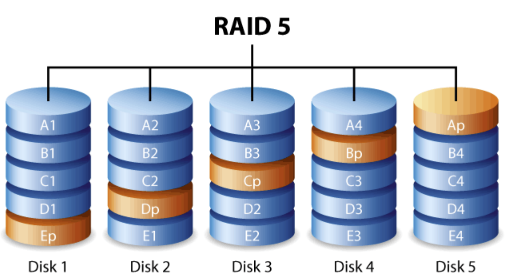

RAID
- RAID 0：把数据分为若干条带（strip），同时写入不同的磁盘
- RAID 1：把相同的数据同时写入所有磁盘
- RAID 01：先把数据划分为条带并发写入磁盘组，再在每个磁盘组写入相同的数据
- RAID 10：把划分后的数据条带写入不同的磁盘组，磁盘组内的每个磁盘写入同样的数据条带
- RAID 4：留出一个磁盘 $A_p$ 作为**校验盘**，其中每个条带存储所有数据盘上条带数据的异或
  - 相比 RAID 0，在保证高利用率的情况下引入了一定的数据改错能力
  - 问题：数据更新时需要同时更新校验盘
    - RMW(read-modify-write)，把老的数据异或上老条带（**需要读出**）、新条带
    - 如果需要同时修改多个条带，就会带来较大的读取开销
    - RRW(read-reconstruct-write)，把未修改的条带读出，异或上新修改的条带
    - 如何选择？看**更新的条带数量**是否超过总条带数量的一半
  - 问题：没有充分利用**校验盘的带宽**；如果对数据盘进行大量更新操作，会导致**校验盘的读写性能成为瓶颈**
- RAID 5：每个磁盘上都有一个校验条带
  
  - 相比 RAID 4，没有容错能力上的变化
  - 问题：没有提供不同的可靠性等级选项
- RAID 6：维护两个校验条带
  - 相比 RAID 5，提高了容错能力
  - [校验数据计算](https://gemini.google.com/share/64bb27b3718d)：一个校验条带使用简单的异或和，另一个校验条带使用伽罗瓦域乘法
    
  - 计算校验条带时会带来额外的 CPU 开销

纠删码 EC(erasure code)
- 从 k 个数据块中生成 m 个编码块，从而可以容忍任意 m 处错误
- 相比直接存储副本，可以显著节省存储成本
- 数据中心的实际应用：对于热数据采用副本存储，当数据变冷后转为纠删码

---

I/O 系统
- I/O 硬件：端口、总线、控制器
- I/O 控制方法
  - 轮询：I/O 设备速度快时采用
  - 中断
  - DMA：**大块数据**的传输只需要一次；需要一个 DMA 控制器
    - 先把 DMA 请求的信息写入内存，之后 CPU 可以执行其它任务，由 DMA 控制器控制总线并执行 I/O 交互
- （**重要**）内核 I/O 子系统
  - 向上对内核开放统一的接口，向下通过 **“驱动-控制器-设备”轴**分别控制每一个 I/O 设备
